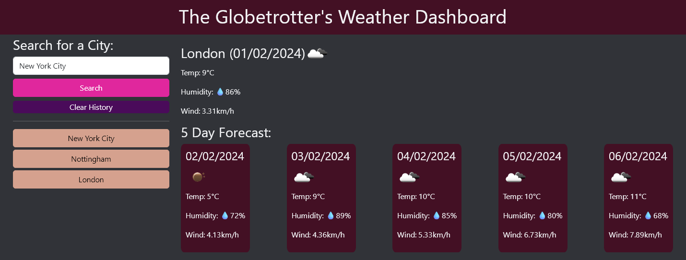

# The Globetrotter's Weather Dashboard
## Description

This weather dashboard can be used to search for 3 hour and 5 day forecasts around the world. The 3 hour or "today's" forecast will give you the weather up to three hours from the time you are using the application. While the 5 day forecast will give you five forecasts each roughly 24 hours apart from today's forecast. You search will be saved as a button which will allow you to view the weather information in that location again.

Throughout this project I have learned how to make use of APIs to fetch and display information and attempted to make use of jquery, dayjs as well more practice with using local storage. As a result of the latter there is a bug in the application that is documented in [Issue #13](https://github.com/applepieorchard/weather-dashboard/issues/13).

### The Dashboard

This application can be found on [Github Pages](https://applepieorchard.github.io/weather-dashboard/)

## Installation

N/A

## Usage

Search for a city if you wish to narrow down the city to a specific country you will need to use [ISO Country Codes](https://www.iso.org/obp/ui/#search) to do so. For example you could search for `Paris, FR` or if you wish to search for American cities you will also need to add the state code, such as if you search `New Orleans, LA, US`. You can simply search for cities on their own but you may not get the city or you looking for. You can then use the weather data at your discretion. If your search history is too full you may click the clear button to delete it. If you leave the field blank the placeholder `London` will be used.

## Credits

This application uses the [Openweather API](https://openweathermap.org/api). [Bootstrap](https://getbootstrap.com/) elements, and both [jquery](https://jquery.com/) and [dayjs](https://day.js.org/).

## License

This Project is subject to the [MIT License](LICENSE).